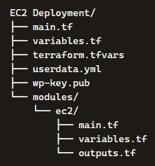
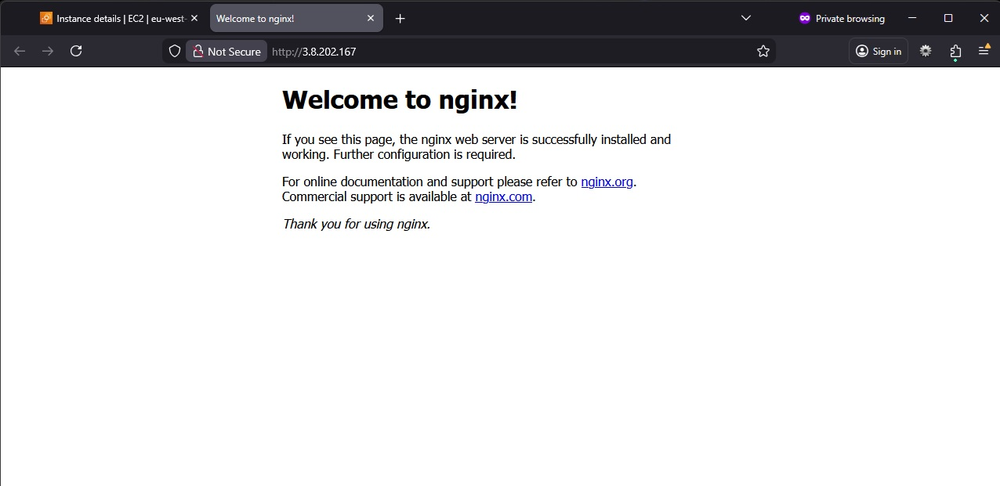

# EC2 Deployment on AWS using Terraform

## Introduction

This assignment focuses on deploying a single EC2 instance using Terraform, installing Nginx via cloud‑init, and validating the deployment end‑to‑end. The goal was to reinforce Terraform fundamentals, understand how cloud‑init behaves on first boot, and practise real-world debugging using SSH, systemctl, and AWS networking components.

The project follows the same modular structure and workflow discipline used in my WordPress deployment, but with a simpler architecture to strengthen core concepts.

---

## Summary of Configuration

| Component            | Description                                                                 |
|----------------------|----------------------------------------------------------------------------------------|
| **Compute**              | Single EC2 instance (Amazon Linux 2023)                                      |
| **Networking**              | Default VPC, public subnet, IGW, auto‑assign public IP                                      |
| **Security Group**    | HTTP (80), SSH (22) restricted to my IP                                 |
| **Key Pair**   | Public key stored in repo, private key stored locally                     |
| **User Data** | Installs Nginx via cloud‑init                                             |
| **Modules**      | EC2 module with Security Group + instance + cloud-init           |
| **Outputs**| Public IP, Public DNS                                        |

## Steps and Configuration

#### Folder Structure



#### 1. EC2 Module

- Launches the instance
- Associates public IP
- Injects user_data
- Attaches security group
- Accepts key pair name

#### 2. Security Group

- Allows HTTP (80) from anywhere
- Allows SSH (22) from my IP only (/32)
- Allows all outbound traffic

#### 3. Key Pair (Optional, added for Debugging)

- Generated locally using ssh-keygen
- Public key uploaded to AWS via Terraform
- Private key used for SSH debugging

#### 4. User Data

- Installs Nginx on first boot:

```#cloud-config
packages:
  - nginx
runcmd:
  - systemctl start nginx
  - systemctl enable nginx
  ```

#### 5. Deployment

I added my ipaddress into `terraform.tfvars` file.

``my_ip = "x.x.x.x./32"``

Then its a case of deploying this via Terraform with the following:

     terraform init
     terraform plan
     terraform apply

#### 6. NGINX Page

After applying the Terraform configuration and navigating to the EC2 public IP, the NGINX page loads successfully:



## What I Learnt

This assignment reinforced several important DevOps fundamentals:

- How Terraform interacts with the default VPC
- How cloud-init behaves on first boot
- How to debug EC2 deployments using SSH
- How to inspect logs (cloud-init-output.log)
- How to diagnose service issues using systemctl
- Why Nginx installs but does not auto-start on Amazon Linux 2023
- How security groups and routing affect connectivity
- How to structure Terraform modules cleanly

A key learning moment was discovering that Nginx was installed successfully but inactive, which caused browser timeouts. `Starting` and `enabling` the service resolved the issue, which was a realistic debugging scenario and helped me to resolve the issue and fix the yaml file.