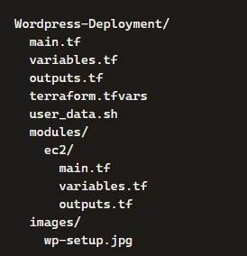
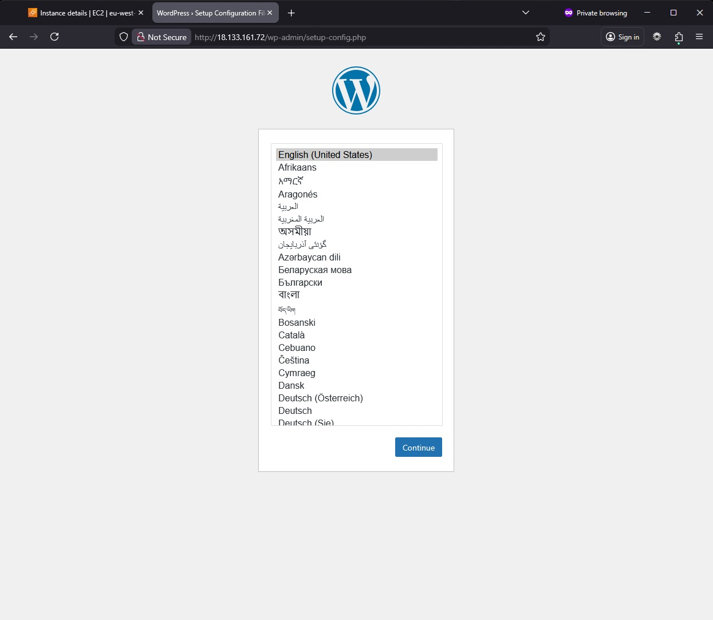

# WordPress Deployment on AWS using Terraform

## Introduction
This project demonstrates a complete Infrastructure‑as‑Code (IaC) deployment of a WordPress application on AWS using Terraform.
The goal was to design and provision a fully functional cloud environment — including networking, compute, security, automation, and application bootstrap — using modular Terraform code.

The deployment includes:

- A custom VPC
- A public subnet
- Internet Gateway + routing
- A modern, modular Security Group design
- An EC2 instance deployed via a reusable module
- Automated WordPress installation using user_data
- Clean repo with variables, tfvars, and .gitignore separation

This project builds on the structure and documentation style from my earlier AWS VPC project, but extends it by integrating compute, automation, and application deployment.

---

## Summary of Configuration

| Component            | Description                                                                 |
|----------------------|----------------------------------------------------------------------------------------|
| **VPC**              | Custom VPC with CIDR block `10.0.0.0/16`                                      |
| **Public Subnet**    | Subnet in eu-west-2a with auto‑assign public IP enabled                                 |
| **Internet Gateway**   | Provides outbound internet access                     |
| **Route Table** | Routes `0.0.0.0/0` traffic to the IGW                                             |
| **Route Table Association**      | Associates the public subnet with the public route table           |
| **Security Group**     | SG with separate ingress/egress rule resources                         |
| **EC2 Module** | Reusable module deploying a **t3.micro** instance          |
| **User Data** | Bootstraps Apache, PHP, MariaDB and WordPress         |
| **Outputs**| Public IP and DNS for accessing WordPress                                        |

## Steps and Configuration

#### Folder Structure

#### Networking Setup

- Created a VPC
- Added a public subnet
- Attached an Internet Gateway
- Configured a route table with a default route
- Associated the subnet with the route table

#### Security Group 

- SG created empty
- Ingress rules created separately
- Egress rule created separately
- Allows:
    - HTTP from anywhere
    - SSH from my IP (optional for debugging)
    - All outbound traffic

#### EC2 Module

- Reusable module
- Accepts AMI, instance type, SG IDs, subnet ID and user_data

#### WordPress Bootstrap via user_data

- Installs Apache, PHP, MariaDB
- Downloads and extracts WordPress
- Removes default Apache index.html
- Sets permissions
- Restarts Apache

#### Wordpress Setup

After applying the Terraform configuration and navigating to the EC2 public IP, the WordPress setup page loads successfully:

## What I Learnt

- How to structure Terraform projects using modules, variables, and tfvars

- How to build AWS networking from scratch (VPC, subnets, IGW, routing)

- Modern Security Group design using separate rule resources

- How user_data works and how to debug cloud-init

- How to automate application deployment (Apache, PHP, WordPress)

- How Terraform recreates resources when dependencies change

